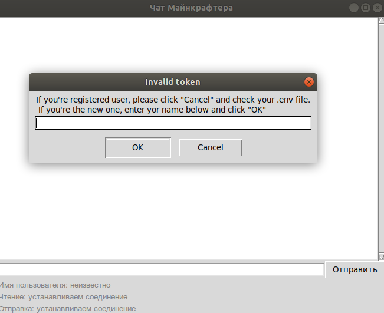
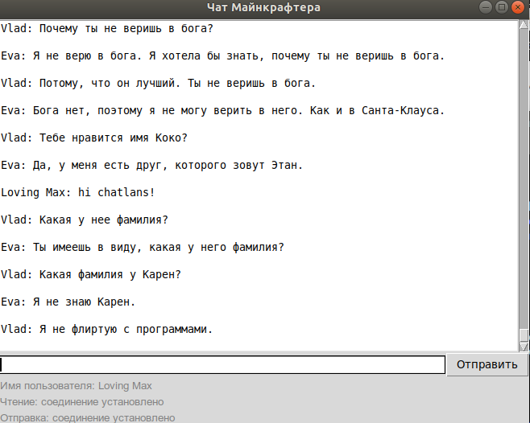

# Anonymous Сhat Сlient

This is [Tkinter GUI](https://docs.python.org/3/library/tkinter.html) based program for chating uses asyncio [streams](https://docs.python.org/3/library/asyncio-stream.html) and [queues](https://docs.python.org/3/library/asyncio-queue.html). Asyncio tasks manage with [aionursery](https://pypi.org/project/aionursery/). User authorize by token, creating new account also available. The explored chat was created by [Devman team](https://dvmn.org/) especially for educational purposes.


## How to install

1. Python 3.7 and libraries from **requirements.txt** should be installed. Use virtual environment tool, for example **virtualenv**

```bash
virtualenv virtualenv_folder_name
source virtualenv_folder_name/bin/activate
python3.7 -m pip install -r requirements.txt
```

2. Put all necessary parameters to **.env** file. This is default parameters and you can change them by CLI arguments.

```
HOST=host_to_connect
PORT_TO_READ=port_for_reading
PORT_TO_WRITE=port_for_writing
FILEPATH=path_to_log_file
```

if you're registered user, add your token to **.env** file:
```
TOKEN=token
```

## Quickstart

Run **server.py** with arguments. Also you can use environment variables as parameters by default.

```bash
python3.7 main.py [--host] [--port_to_read] [--port_to_write] [--token] [--filepath]
```




## Project Goals

The code is written for educational purposes on online-course for web-developers [dvmn.org](https://dvmn.org/).
